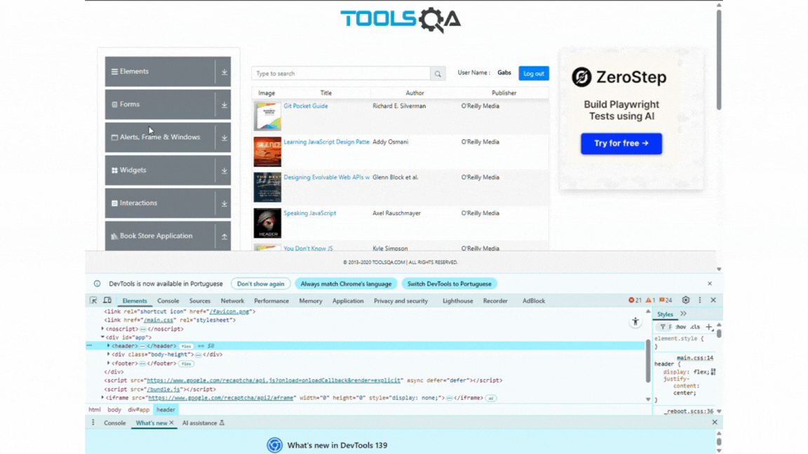

# DESAFIO - QA AUTOMATION ENGINEER
Candidata: Gabriele Monteiro de Medeiros

## Resumo: 
O Desafio de QA Automation da Accenture, está dividido em duas partes. A primeira delas, consiste em um desafio técnico com foco em API, e a segunda, com o foco em automação de elementos visuais.

### Tecnologias utilizadas:
Para o projeto foi utilizado o JavaScript com uso do Cypress na versão 14.5.4. A escolha por essas ferramentas foi dada disponibilidade de configuração prévia em meu computador, facilitando o desenvolvimento das automações.

### Executando os testes
Modo interativo: `npx cypress open`

### Caso de Teste Implementados
- Parte 1 (arquivo: Desafio_Parte1.cy.js)
  - Etapas:
    - Criar um usuário
    - Gerar um token de acesso
    - Confirmar se o usuário criado está autorizado
    - Listar os livros disponíveis 
    
  - Dificuldades encontradas:
    - Passo executado: Clicar no título dos livros disponíveis.
    - Comportamento observado: Redireciona para uma tela em branco.
    - Comportamento esperado: Exibir detalhes do livro.
    

  

  - Parte 2 
    - Preencher e enviar o formulário (arquivo: Desafio_Parte2_1.cy.js):
      - Etapas 
        - Acessar o site https://demoqa.com/
        - Escolher a opção Forms na página inicial
        - Clicar no submenu Practice Form
        - Preencher todo o formulário com valores aleatórios
        - O Arquivo utilizado para upload, precisa ser um .txt qualquer
        - Submter o formulário
        - Garantir que um popup foi aberto após o submit
        - Fechar o popup
       

    - Preencher e enviar o formulário (arquivo: Desafio_Parte2_2.cy.js):
      - Etapas 
        - Acessar o site https://demoqa.com/
        - Escolher a opção Alerts, Frame & Windows na página inicial
        - Clicar no submenu Browser Windows
        - Clicar no botão new Windows
        - Certifica-se que uma nova janela foi aberta, e validar a msg “This is a sample page”
        - Fechar a nova janela aberta

    - Preencher e enviar o formulário (arquivo: Desafio_Parte2_3.cy.js):
      - Etapas 
        - Acessar o site https://demoqa.com/
        - Escolher a opção Elements na página inicial
        - Clicar no submenu Web Tables
        - Criar um novo registro
        - Editar o novo registro criado
        - Deletar o novo registro criado.

    - Preencher e enviar o formulário (arquivo: Desafio_Parte2_4.cy.js):
      - Etapas 
        - Acessar o site https://demoqa.com/
        - Escolher a opção Widgets na página inicial
        - Clicar no submenu Progress Bar
        - Clicar no botão Start
        - Parar antes dos 25%
        - Validar que o valor da progress Bar é menor ou igual aos 25%
        - Apertar Start novamente e ao chegar aos 100%, resetar a progress bar

    - Preencher e enviar o formulário (arquivo: Desafio_Parte2_5.cy.js):
      - Etapas 
        - Acessar o site https://demoqa.com/
        - Escolher a opção Interactions na página inicial
        - Clicar no submenu Sortable
        - Utilizando métodos de drag and drop, colocar os elementos na ordem crescente
 
